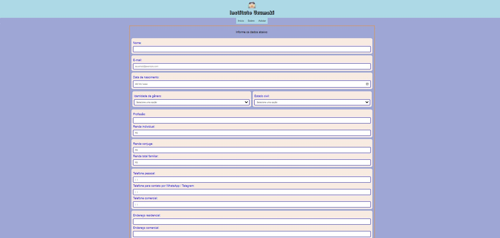

## Instituto Uzumaki
Aplicacao para facilitacao dos documentos para pessoas entrando em processo de adocao.

## Screenshots

Header


Home


Formulario


## Autoria

<a href="http://www.linkedin.com/in/karinepaiva">Karine Paiva</a>

## Referência de cores

| Cor            | Referência                                                        |
| ----------------- | -------------------------------------------------------------- |
| Azul claro | lightblue |
| Azul | blue |
| Pret  | black |
| Branco | white |
| Lilás | rgb(158, 166, 214)  |
| Laranja | rgb(255, 139, 6)  |
| Laranja claro | rgb(248, 235, 225) |
| Azul claro | #3a6fa3 |

## 🛠 Skills
Javascript, HTML, CSS, nodemon, html-pdf-node, joi, ejs, express.


## Comandos de start no servidor local


Projeto para clonar 

```bash
  git clone [https://gitlab.com/karine.paiva1/1projetcpdf]
```

Instalacao das dependencias

```bash
  npm install
```

Inicie o servidor

```bash
  npm run dev